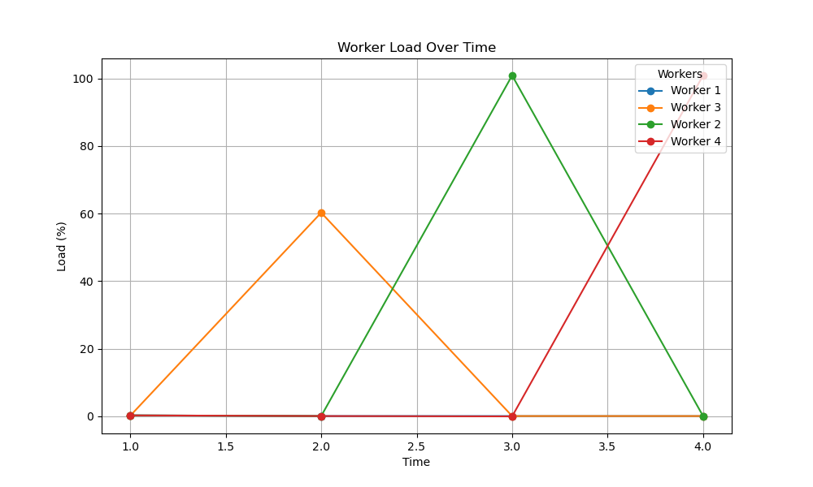
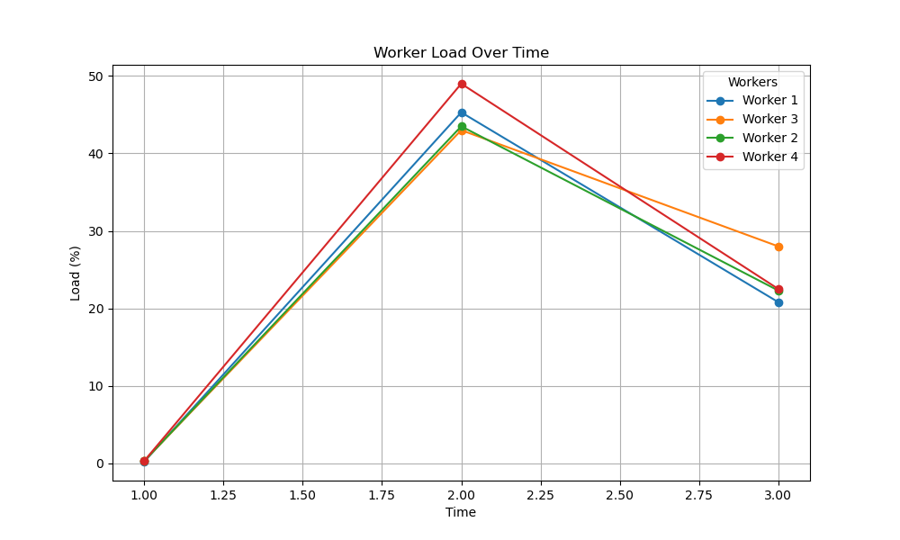
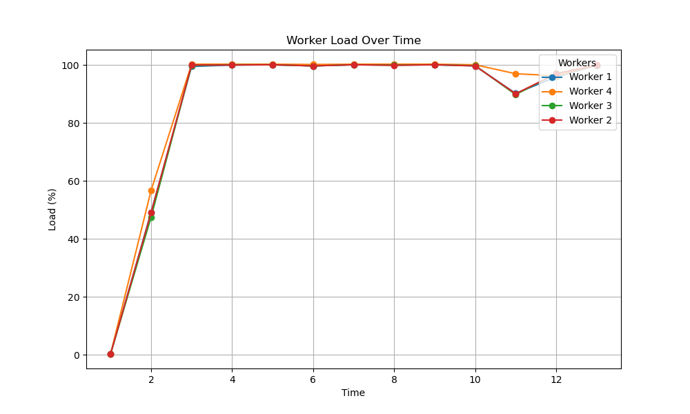
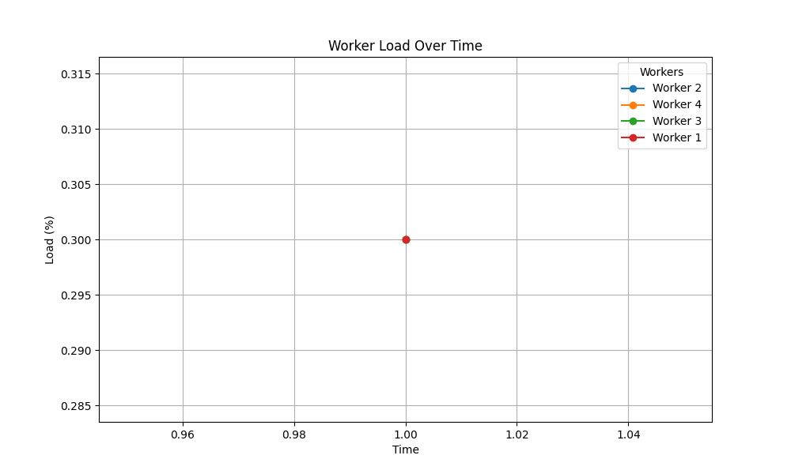
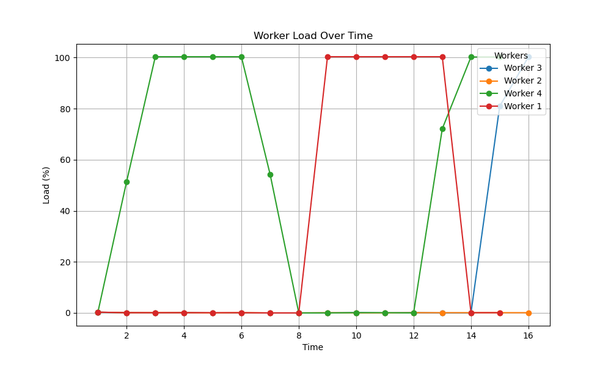
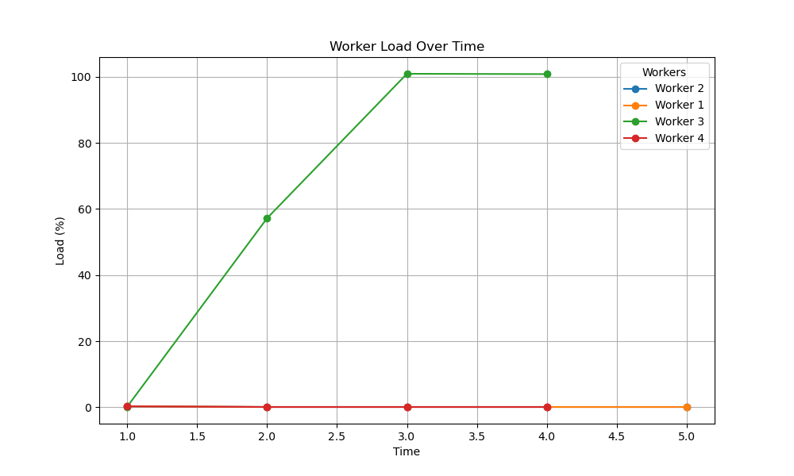
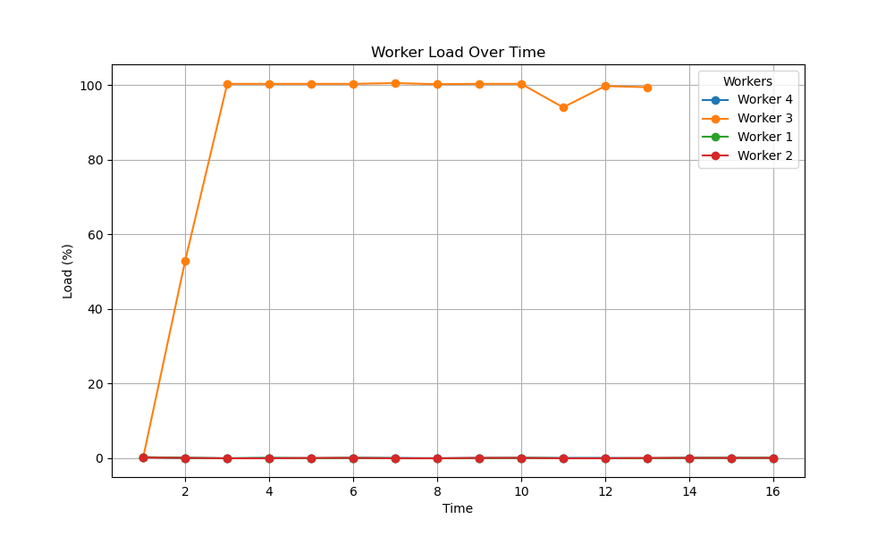

# Load Balancer System with gRPC

A distributed load balancing system built with gRPC and Python that supports multiple load balancing policies. The system uses Consul for service discovery and health checking.



## Features

- **Multiple Load Balancing Policies**:
  - **Round Robin (RR)**: Distributes requests sequentially among available workers
  - **Least Loaded (LL)**: Routes requests to the worker with the lowest current load
  - **Pick First (PF)**: Sends all requests to the first available worker
  
- **Service Discovery**: Uses Consul for service registration and discovery
- **Health Checking**: Automatically detects and handles worker failures
- **Load Monitoring**: Tracks and visualizes worker load distribution
- **Scalable Architecture**: Easily add or remove workers as needed

## Prerequisites

- Python 3.7+
- Consul
- gRPC tools

## Installation

1. Clone the repository:
   ```
   git clone <repository-url>
   cd <repository-directory>
   ```

2. Install required dependencies:
   ```
   make compile
   ```

## How to Run

1. Start Consul (in a separate terminal):
   ```
   make consul
   ```

2. Start the Load Balancer with your preferred policy (in a new terminal):
   ```
   make lb POLICY=rr  # Options: rr (Round Robin), ll (Least Loaded), pf (Pick First)
   ```

3. Start worker nodes (in a new terminal):
   ```
   make workers WORKERS=4  # Start 4 worker nodes
   ```

4. Run a client to test the system:
   ```
   make run_client
   ```

5. Run automated tests with specified parameters:
   ```
   python3 test.py --workers=4 --policy=ll --load=medium
   ```

## Load Distribution Visualization

### Round Robin Policy

| Low Load | Medium Load | High Load |
|:---:|:---:|:---:|
|  |  |  |

### Least Loaded Policy

| Low Load | Medium Load | High Load |
|:---:|:---:|:---:|
|  |  |  |

### Pick First Policy

| Low Load | Medium Load | High Load |
|:---:|:---:|:---:|
|  |  |  |

## Project Structure

- `client/`: Client code that sends requests to the load balancer
- `server/`: Contains the load balancer and worker implementations
- `proto/`: Protocol buffer definitions for gRPC services
- `generated/`: Auto-generated gRPC code
- `utils/`: Utility functions and helpers
- `test_files/`: Load distribution visualization and test data

## Advanced Configuration

You can customize various parameters:

- `--port`: Set the port for load balancer (default: 50051)
- `--interval`: Set health check interval in seconds (default: 10)
- `--policy`: Set load balancing policy (default: rr)
- `--workers`: Number of worker nodes to start (default: 1)
- `--base-port`: Starting port number for worker nodes (default: 50052)